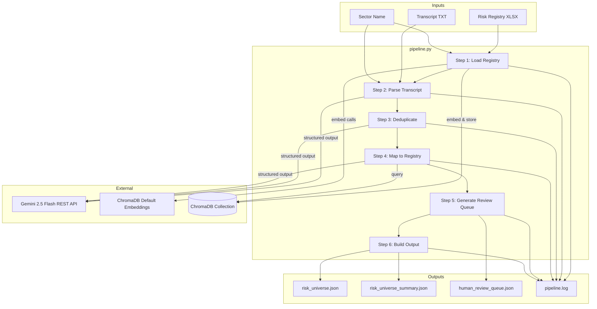
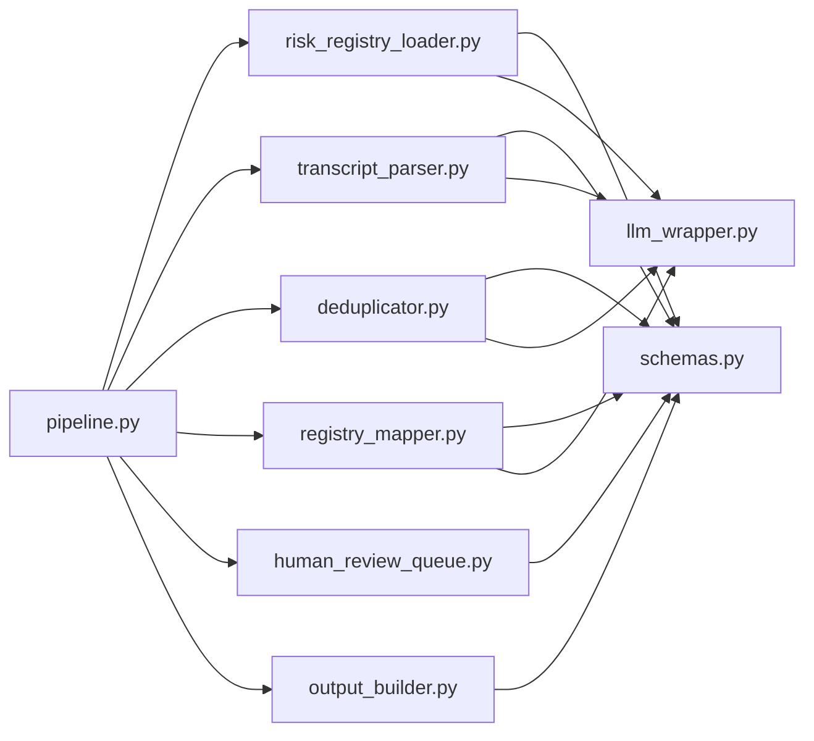
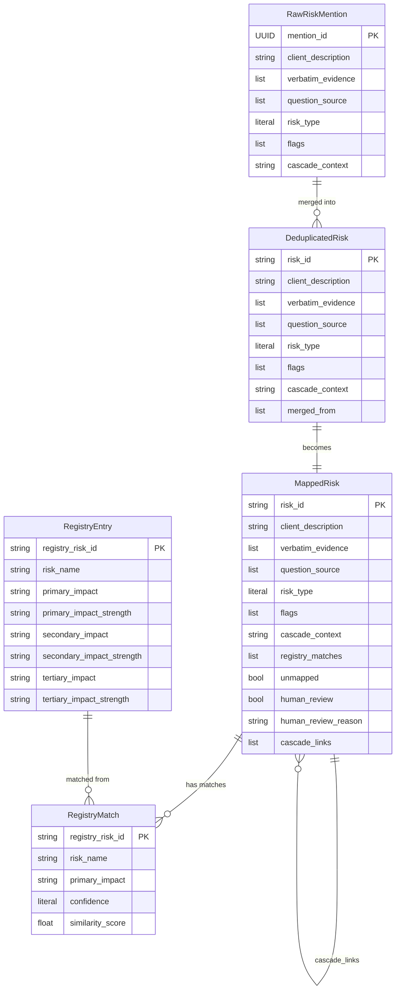
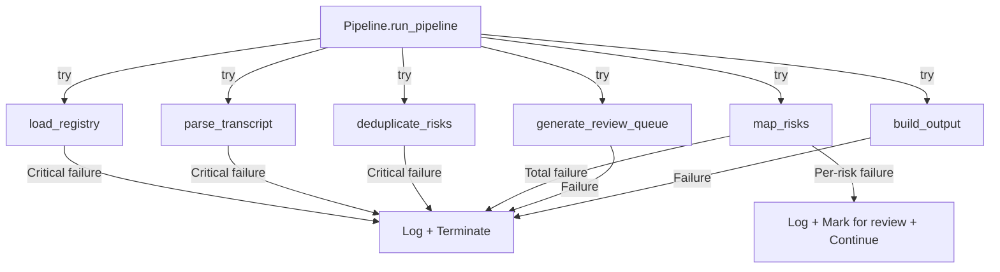

# Design Document: RiskMapper Agent System

## Overview

RiskMapper is a Python-based AI agent pipeline that processes CRO interview transcripts and produces a structured risk universe mapped against a backend risk registry. The system is composed of 8 modules orchestrated by a sequential pipeline, with LLM calls (Google Gemini 2.5 Flash via REST API) for extraction, deduplication, and semantic mapping, and ChromaDB for vector-based registry search.

The pipeline flow is:

```
Transcript (TXT) + Registry (XLSX)
        │
        ▼
┌─────────────────────┐
│ Risk Registry Loader │──► ChromaDB "risk_registry" collection
└─────────────────────┘
        │
        ▼
┌─────────────────────┐
│  Transcript Parser   │──► List[RawRiskMention]
└─────────────────────┘
        │
        ▼
┌─────────────────────┐
│    Deduplicator      │──► List[DeduplicatedRisk]
└─────────────────────┘
        │
        ▼
┌─────────────────────┐
│  Registry Mapper     │──► List[MappedRisk]
└─────────────────────┘
        │
        ▼
┌──────────────────────────┐    ┌─────────────────┐
│ Human Review Queue Gen.  │    │  Output Builder  │
└──────────────────────────┘    └─────────────────┘
        │                              │
        ▼                              ▼
  human_review_queue.json    risk_universe.json
                             risk_universe_summary.json
                             pipeline.log
```

Key design decisions:
- **Single-process, sequential pipeline** — no async or parallel execution needed for MVP. Each step completes before the next begins.
- **LLM JSON mode** — all Gemini 2.5 Flash calls use `responseMimeType: "application/json"` with a `responseSchema` derived from Pydantic models, temperature=0, ensuring deterministic and schema-valid responses. Responses are validated against Pydantic models after receipt.
- **ChromaDB local persistent storage** — the vector store is a local directory-backed ChromaDB collection, not a server. Embeddings use ChromaDB's default Sentence Transformers embedding function (local, no API calls).
- **Provider-swappable LLM wrapper** — a thin wrapper around the Gemini REST API (using Python `requests`) that all modules call, making it straightforward to swap providers later.
- **Fail-forward on individual risks** — if mapping a single risk fails, the pipeline logs the error and marks it for human review rather than terminating.

## Architecture



### Module Dependency Graph



All modules import from `schemas.py` for data types. Modules that call the LLM import from `llm_wrapper.py`. The `pipeline.py` module imports all other modules and orchestrates execution.

## Components and Interfaces

### 1. `schemas.py` — Pydantic Data Models

Pure data definitions with no external dependencies beyond Pydantic v2.

```python
# Key interfaces (simplified signatures)

class RawRiskMention(BaseModel):
    mention_id: UUID
    client_description: str
    verbatim_evidence: list[str]
    question_source: list[str]          # Each matches Q1-Q15
    risk_type: Literal["INHERENT", "EVENT_DRIVEN", "BOTH"]
    flags: list[Literal["UNREGISTERED", "UNDERPREPARED", "CASCADE_SIGNAL"]]
    cascade_context: str | None = None

class DeduplicatedRisk(BaseModel):
    risk_id: str                        # Pattern: RISK_NNN
    client_description: str
    verbatim_evidence: list[str]
    question_source: list[str]
    risk_type: Literal["INHERENT", "EVENT_DRIVEN", "BOTH"]
    flags: list[Literal["UNREGISTERED", "UNDERPREPARED", "CASCADE_SIGNAL"]]
    cascade_context: str | None = None
    merged_from: list[str]              # mention_id values

class RegistryMatch(BaseModel):
    registry_risk_id: str
    risk_name: str
    primary_impact: str
    confidence: Literal["HIGH", "MEDIUM", "LOW"]
    similarity_score: float             # 0.0 to 1.0, validated

class MappedRisk(BaseModel):
    risk_id: str
    client_description: str
    verbatim_evidence: list[str]
    question_source: list[str]
    risk_type: Literal["INHERENT", "EVENT_DRIVEN", "BOTH"]
    flags: list[Literal["UNREGISTERED", "UNDERPREPARED", "CASCADE_SIGNAL"]]
    cascade_context: str | None = None
    registry_matches: list[RegistryMatch]
    unmapped: bool
    human_review: bool
    human_review_reason: str | None = None
    cascade_links: list[str]            # Other risk_id values
```

Validation rules:
- `question_source` entries must match regex `^Q(1[0-5]|[1-9])$`
- `risk_id` must match regex `^RISK_\d{3}$`
- `similarity_score` must be `>= 0.0` and `<= 1.0`
- Pydantic `ValidationError` raised on any constraint violation

### 2. `llm_wrapper.py` — LLM Provider Wrapper

```python
class LLMWrapper:
    def __init__(self, model: str = "gemini-2.5-flash-preview-05-20", api_key: str | None = None):
        """Initialize with model name. Loads GEMINI_API_KEY from env if not provided."""

    def call(
        self,
        prompt: str,
        response_model: type[BaseModel],
        temperature: float = 0.0,
        step_name: str = "",
    ) -> BaseModel:
        """
        Call the Gemini REST API with JSON mode (responseMimeType + responseSchema).
        Retries up to 3 times with exponential backoff on API errors.
        Logs model name, token counts, latency, and step_name.
        Returns a validated Pydantic model instance.
        Raises LLMCallError if all retries exhausted.
        """
```

Implementation details:
- Uses Python `requests` library to POST to `https://generativelanguage.googleapis.com/v1beta/models/{model}:generateContent`
- Authentication via `X-goog-api-key` header with the GEMINI_API_KEY
- Structured output via `generationConfig.responseMimeType: "application/json"` and `generationConfig.responseSchema` derived from Pydantic model's `.model_json_schema()`
- Response JSON is parsed and validated against the Pydantic model using `model_validate()`
- Retry delays: 1s, 2s, 4s (exponential backoff)
- Logging via Python `logging` module at INFO level for successful calls, ERROR for failures
- `LLMCallError` wraps the underlying error without exposing raw Gemini API details
- Token counts extracted from `usageMetadata` in the Gemini response

### 3. `risk_registry_loader.py` — Registry Loading & Embedding

```python
def load_registry(
    xlsx_path: str,
    sector: str,
    chroma_client: chromadb.ClientAPI,
    embedding_fn: EmbeddingFunction,
) -> int:
    """
    Load risk entries from the sector sheet into ChromaDB collection "risk_registry".
    Returns the number of entries loaded.
    Raises FileNotFoundError if xlsx_path doesn't exist.
    Raises ValueError if sector sheet not found or sheet is empty.
    Idempotent: deletes and recreates collection on each call.
    """
```

Implementation details:
- Reads XLSX with `openpyxl` — iterates rows in the named sector sheet
- Generates a `registry_risk_id` per row: `REG_{sector_prefix}_{row_index:03d}`
- Embedding text format: `"{Primary Impact} - {Risk Name}"`
- Uses ChromaDB's default embedding function (Sentence Transformers, local — no external API calls)
- Idempotency achieved by deleting the collection if it exists, then recreating it
- Stores metadata: `registry_risk_id`, `risk_name`, `primary_impact`

### 4. `transcript_parser.py` — Risk Extraction

```python
def parse_transcript(
    transcript_text: str,
    sector: str,
    llm: LLMWrapper,
) -> list[RawRiskMention]:
    """
    Extract risk mentions from transcript using LLM structured output.
    Raises ValueError if zero mentions extracted.
    """
```

Implementation details:
- Constructs a prompt that includes the full RiskMapper agent system prompt (Step 1 instructions), the sector context, and the transcript text
- Requests a response conforming to a wrapper model `TranscriptParseResponse(mentions: list[RawRiskMention])`
- The LLM assigns `mention_id` (UUID), `question_source`, `risk_type`, `flags`, `verbatim_evidence`, and `cascade_context`
- Temperature=0, structured output mode
- Logs via `step_name="transcript_parsing"`

### 5. `deduplicator.py` — Risk Deduplication

```python
def deduplicate_risks(
    mentions: list[RawRiskMention],
    llm: LLMWrapper,
) -> list[DeduplicatedRisk]:
    """
    Merge semantically duplicate risk mentions into deduplicated risks.
    Assigns sequential RISK_001, RISK_002, ... IDs.
    """
```

Implementation details:
- Sends all mentions to the LLM with instructions to identify semantic duplicates and merge them
- The LLM returns groups of `mention_id` values that should be merged
- For each group, the module constructs a `DeduplicatedRisk` by:
  - Assigning a sequential `risk_id` (RISK_001, RISK_002, ...)
  - Using the LLM-selected best `client_description` for the group
  - Combining all `verbatim_evidence` and `question_source` lists (deduped)
  - Merging `flags` (union of all flags from merged mentions)
  - Setting `merged_from` to the list of constituent `mention_id` values
- Temperature=0, structured output mode
- Logs via `step_name="deduplication"`

### 6. `registry_mapper.py` — Semantic Matching

```python
def map_risks(
    risks: list[DeduplicatedRisk],
    sector: str,
    chroma_client: chromadb.ClientAPI,
    embedding_fn: EmbeddingFunction,
    llm: LLMWrapper,
) -> list[MappedRisk]:
    """
    For each risk, query ChromaDB for top-3 candidates, then use LLM to assign confidence.
    Marks risks as unmapped if best confidence is LOW and best similarity < 0.75.
    Raises RuntimeError if collection is empty.
    """
```

Implementation details:
- For each `DeduplicatedRisk`:
  1. Query ChromaDB with the `client_description` text, `n_results=3`
  2. Build candidate list with `registry_risk_id`, `risk_name`, `primary_impact`, `similarity_score`
  3. Send candidates + risk description + sector to LLM for confidence evaluation
  4. LLM returns `Literal["HIGH", "MEDIUM", "LOW"]` per candidate
  5. Construct `RegistryMatch` objects
  6. If best confidence is LOW and best similarity_score < 0.75 → `unmapped=True`, `human_review=True`
- If processing a single risk fails, catch the exception, log it, and produce a `MappedRisk` with `unmapped=True`, `human_review=True`, `human_review_reason` describing the failure
- Temperature=0, structured output mode
- Logs via `step_name="registry_mapping"`

### 7. `human_review_queue.py` — Review Queue Generation

```python
def generate_review_queue(
    mapped_risks: list[MappedRisk],
    output_path: str,
) -> int:
    """
    Filter risks where human_review=True and write to JSON file.
    Returns count of risks in queue. Writes empty array if none.
    """
```

Implementation details:
- Filters `mapped_risks` where `human_review is True`
- Serializes using Pydantic `model_dump(mode="json")` for each risk
- Writes UTF-8 JSON with `json.dump(..., indent=2, ensure_ascii=False)`
- Returns the count of queued risks

### 8. `output_builder.py` — Output Generation

```python
def build_output(
    mapped_risks: list[MappedRisk],
    output_dir: str,
) -> None:
    """
    Write risk_universe.json and risk_universe_summary.json to output_dir.
    Creates output_dir if it doesn't exist.
    """
```

Implementation details:
- Creates `output_dir` with `os.makedirs(output_dir, exist_ok=True)`
- `risk_universe.json`: serializes the full `list[MappedRisk]` via Pydantic `model_dump(mode="json")`
- `risk_universe_summary.json`: computes and writes:
  - `total_risks`: `len(mapped_risks)`
  - `mapped_count`: count where `unmapped is False`
  - `unmapped_count`: count where `unmapped is True`
  - `human_review_count`: count where `human_review is True`
  - `risks`: list of `{risk_id, client_description, unmapped, registry_match_count}`
- Invariant enforced: `total_risks == mapped_count + unmapped_count`
- UTF-8 JSON with `indent=2`

### 9. `pipeline.py` — Orchestration

```python
def run_pipeline(
    transcript_path: str,
    sector: str,
    registry_path: str,
    output_dir: str,
) -> None:
    """
    Execute the full pipeline: load registry → parse transcript → deduplicate →
    map → generate review queue → build output.
    Writes pipeline.log to output_dir.
    """
```

Implementation details:
- Validates inputs at startup: checks file existence, checks `GEMINI_API_KEY` env var
- Initializes `LLMWrapper`, ChromaDB client (persistent, directory in output_dir), default embedding function
- Executes steps sequentially, timing each step
- Configures Python `logging` to write to `{output_dir}/pipeline.log` with timestamps
- Critical failures (registry loading, transcript parsing) terminate the pipeline
- Non-critical failures (individual risk mapping) are logged and processing continues

## Data Models

### Entity Relationship Diagram



### Data Flow Through Pipeline

1. **Registry Loading**: XLSX rows → `RegistryEntry` (in-memory) → ChromaDB documents with embeddings
2. **Transcript Parsing**: Raw text → LLM → `list[RawRiskMention]`
3. **Deduplication**: `list[RawRiskMention]` → LLM → `list[DeduplicatedRisk]` (count ≤ input count)
4. **Registry Mapping**: `list[DeduplicatedRisk]` + ChromaDB queries + LLM → `list[MappedRisk]`
5. **Review Queue**: `list[MappedRisk]` → filtered → `human_review_queue.json`
6. **Output Building**: `list[MappedRisk]` → `risk_universe.json` + `risk_universe_summary.json`

### ChromaDB Collection Schema

Collection name: `risk_registry`
- **id**: `REG_{sector_prefix}_{row_index:03d}` (e.g., `REG_TEL_001`)
- **document**: `"{Primary Impact} - {Risk Name}"` (the text that gets embedded)
- **metadata**: `{"registry_risk_id": str, "risk_name": str, "primary_impact": str}`
- **embedding**: generated by ChromaDB default Sentence Transformers (384 dimensions)
- **distance metric**: cosine


## Correctness Properties

*A property is a characteristic or behavior that should hold true across all valid executions of a system — essentially, a formal statement about what the system should do. Properties serve as the bridge between human-readable specifications and machine-verifiable correctness guarantees.*

### Property 1: Schema round-trip serialization

*For any* valid instance of RawRiskMention, DeduplicatedRisk, RegistryMatch, or MappedRisk, serializing to JSON via `model_dump_json()` and then deserializing back via `model_validate_json()` shall produce an object equal to the original.

**Validates: Requirements 1.6, 12.2**

### Property 2: Schema validation rejects invalid data

*For any* schema type and *for any* field value that violates its constraint (e.g., `similarity_score` outside [0.0, 1.0], `risk_id` not matching `RISK_\d{3}`, `question_source` entries not matching `Q1`–`Q15`), constructing the schema shall raise a Pydantic `ValidationError`.

**Validates: Requirements 1.5**

### Property 3: Registry loader idempotency

*For any* valid XLSX file and sector name, calling `load_registry` twice with the same arguments shall produce the same ChromaDB collection state (same document count, same IDs, same metadata) as calling it once.

**Validates: Requirements 2.4**

### Property 4: Deduplication preserves all input data

*For any* list of RawRiskMention objects and any deduplication result, the union of all `merged_from` fields across all DeduplicatedRisk objects shall equal the set of all input `mention_id` values, and the combined `verbatim_evidence` and `question_source` across each merge group shall be a superset of the evidence and sources from each constituent mention.

**Validates: Requirements 4.3, 4.4**

### Property 5: Deduplication count invariant

*For any* list of RawRiskMention objects, the number of DeduplicatedRisk objects produced by the Deduplicator shall be less than or equal to the number of input mentions.

**Validates: Requirements 4.8, 12.3**

### Property 6: Unmapped flag decision rule

*For any* MappedRisk where the highest confidence among `registry_matches` is LOW and the highest `similarity_score` is below 0.75, the `unmapped` field shall be `true`. Conversely, *for any* MappedRisk where at least one match has confidence HIGH or MEDIUM, or the highest similarity_score is ≥ 0.75, the `unmapped` field shall be `false`.

**Validates: Requirements 5.3**

### Property 7: Human review queue filtering

*For any* list of MappedRisk objects, the human review queue output shall contain exactly the risks where `human_review` is `true`, and no others. The count of risks in the queue shall equal the count of input risks with `human_review == True`.

**Validates: Requirements 6.1**

### Property 8: Output file round-trip

*For any* list of MappedRisk objects, writing `risk_universe.json` via the Output_Builder and then reading and parsing the file back shall produce a list of MappedRisk objects equal to the original. The same shall hold for the human review queue JSON file.

**Validates: Requirements 6.5, 7.5**

### Property 9: Summary count invariant

*For any* list of MappedRisk objects, the Output_Builder summary shall satisfy: `total_risks == mapped_count + unmapped_count`, where `mapped_count` is the count of risks with `unmapped == False` and `unmapped_count` is the count with `unmapped == True`. Additionally, `total_risks` shall equal `len(mapped_risks)` and `human_review_count` shall equal the count of risks with `human_review == True`.

**Validates: Requirements 7.2, 7.6, 12.4**

## Error Handling

### Error Categories and Strategies

| Error Type | Source | Strategy | Severity |
|---|---|---|---|
| Missing input file | Pipeline startup | Raise `FileNotFoundError` with path, terminate | Critical |
| Missing sector sheet | Registry loader | Raise `ValueError` with file path + sheet name, terminate | Critical |
| Empty sector sheet | Registry loader | Raise `ValueError`, terminate | Critical |
| Missing API key | Pipeline startup | Raise `EnvironmentError`, terminate before processing | Critical |
| LLM API error | LLM wrapper | Retry 3× with exponential backoff (1s, 2s, 4s) | Transient |
| LLM retries exhausted | LLM wrapper | Raise `LLMCallError` (no raw Gemini API details) | Critical per-call |
| Zero mentions extracted | Transcript parser | Raise `ValueError` | Critical |
| Single risk mapping failure | Registry mapper | Log error, mark risk as `unmapped` + `human_review=True`, continue | Non-critical |
| Empty vector store | Registry mapper | Raise `RuntimeError` | Critical |
| JSON write failure | Output builder / review queue | Raise `IOError` with path context | Critical |

### Error Propagation



### Custom Exceptions

```python
class LLMCallError(Exception):
    """Raised when LLM call fails after all retries. Does not expose raw Gemini API details."""

class RegistryLoadError(Exception):
    """Raised when registry loading fails due to file/sheet issues."""

class PipelineError(Exception):
    """Raised when a critical pipeline step fails."""
```

### Retry Configuration

All LLM calls use the same retry policy defined in `llm_wrapper.py`:
- Max retries: 3
- Backoff: exponential (1s, 2s, 4s)
- Retryable errors: API connection errors, rate limits, server errors (5xx)
- Non-retryable errors: authentication errors, invalid request errors

## Testing Strategy

### Testing Framework and Libraries

- **pytest** — test runner and assertions
- **hypothesis** — property-based testing library for Python
- **pytest-mock / unittest.mock** — mocking LLM calls, ChromaDB, file I/O
- **tmp_path** (pytest fixture) — temporary directories for file output tests

### Property-Based Tests (Hypothesis)

Each correctness property maps to a single Hypothesis test with a minimum of 100 examples (`@settings(max_examples=100)`).

| Property | Test File | What's Generated |
|---|---|---|
| P1: Schema round-trip | `test_schemas.py` | Random valid instances of all 4 schema types |
| P2: Validation rejects invalid | `test_schemas.py` | Random invalid field values per schema |
| P3: Registry idempotency | `test_risk_registry_loader.py` | Random registry data (mocked XLSX + local ChromaDB) |
| P4: Dedup preserves data | `test_deduplicator.py` | Random RawRiskMention lists + mocked LLM merge groups |
| P5: Dedup count invariant | `test_deduplicator.py` | Random RawRiskMention lists of varying sizes |
| P6: Unmapped decision rule | `test_registry_mapper.py` | Random RegistryMatch lists with varying confidence/scores |
| P7: Review queue filtering | `test_human_review_queue.py` | Random MappedRisk lists with varying human_review flags |
| P8: Output round-trip | `test_output_builder.py` | Random MappedRisk lists |
| P9: Summary count invariant | `test_output_builder.py` | Random MappedRisk lists with varying unmapped/review flags |

Tag format for each test: `# Feature: riskmapper-agent-system, Property {N}: {title}`

### Hypothesis Custom Strategies

Define reusable Hypothesis strategies for generating valid schema instances:

```python
# strategies.py (test helpers)
from hypothesis import strategies as st

valid_question_source = st.sampled_from([f"Q{i}" for i in range(1, 16)])
valid_risk_type = st.sampled_from(["INHERENT", "EVENT_DRIVEN", "BOTH"])
valid_flags = st.lists(st.sampled_from(["UNREGISTERED", "UNDERPREPARED", "CASCADE_SIGNAL"]), max_size=3, unique=True)
valid_confidence = st.sampled_from(["HIGH", "MEDIUM", "LOW"])
valid_similarity = st.floats(min_value=0.0, max_value=1.0, allow_nan=False, allow_infinity=False)
```

### Unit Tests (Example-Based)

Each module gets at least 2 example-based pytest tests covering:

| Module | Key Tests |
|---|---|
| `schemas.py` | Valid construction of each schema, specific validation error cases |
| `llm_wrapper.py` | Successful call with mocked Gemini API, retry behavior on failure, error wrapping |
| `risk_registry_loader.py` | Load from test XLSX, missing file error, missing sheet error, empty sheet error |
| `transcript_parser.py` | Parse with mocked LLM, zero mentions error, sector in prompt, retry on failure |
| `deduplicator.py` | Merge with mocked LLM, sequential ID assignment, single-mention passthrough |
| `registry_mapper.py` | Map with mocked LLM + ChromaDB, unmapped threshold, per-risk failure handling, empty collection error |
| `human_review_queue.py` | Filter and write, empty queue, reason preservation |
| `output_builder.py` | Write files, create directory, summary computation |
| `pipeline.py` | Full run with all mocks, missing transcript error, missing API key error, critical step failure |

### Test Organization

```
tests/
├── conftest.py              # Shared fixtures (mock LLM, mock ChromaDB, sample data)
├── strategies.py            # Hypothesis custom strategies for schema generation
├── test_schemas.py          # Property tests P1, P2 + unit tests
├── test_llm_wrapper.py      # Unit tests for retry, error wrapping
├── test_risk_registry_loader.py  # Property test P3 + unit tests
├── test_transcript_parser.py     # Unit tests with mocked LLM
├── test_deduplicator.py          # Property tests P4, P5 + unit tests
├── test_registry_mapper.py       # Property test P6 + unit tests
├── test_human_review_queue.py    # Property test P7 + unit tests
├── test_output_builder.py        # Property tests P8, P9 + unit tests
└── test_pipeline.py              # Integration tests with all mocks
```

### Mocking Strategy

- **LLM calls**: Mock `LLMWrapper.call()` to return pre-built Pydantic model instances. For property tests, the mock returns deterministic merge/mapping results derived from the generated input.
- **ChromaDB**: Use a real local ephemeral ChromaDB client (`chromadb.EphemeralClient()`) for registry loader and mapper tests — no mock needed since it's fast and in-memory.
- **File I/O**: Use pytest `tmp_path` fixture for all file write/read tests. For XLSX tests, create small test workbooks with `openpyxl` in fixtures.
- **Environment variables**: Use `monkeypatch` to set/unset `GEMINI_API_KEY`.
